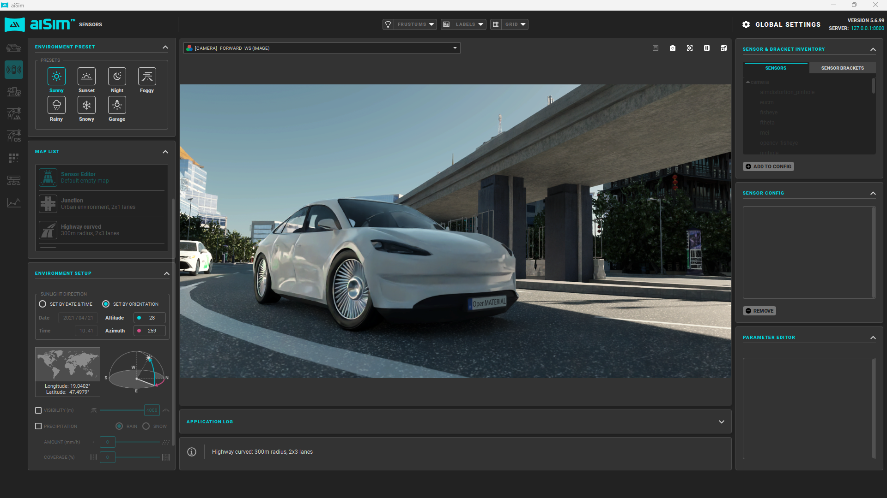

# aiSim Archer: a cutting-edge 3D vehicle model for simulation excellence

Meet aiSimArcher, our latest creation that embodies aiMotive's understanding of the new OpenMATERIAL standard (ASAM OpenMATERIAL 3D :: OpenMATERIAL® 3D). This versatile, fictitious vehicle is designed to combine modern car aesthetics with real-time rendering optimization, making it the perfect example for standard-driven 3D simulation.

## Key features:

- High-resolution design: Comprising approximately 140,000 triangles, aiSimArcher boasts intricate exterior details and a simplified schematic interior for streamlined performance.

- Standards-compliant structure: Faithfully adheres to ASAM OpenMATERIAL 3D hierarchy, transformations, pivot-placement, and naming conventions.

- Realistic lighting: The model includes 23 optimized light nodes prepared for detailed light source setup for realistic and performance-efficient renders.

- Unmatched customization: Fully UV-unwrapped layout for seamless texturing and parameter-driven materials, with additional tire normal maps for high-quality visuals.

- Ready for integration: A complete package featuring a glTF 3D model, texture files, and an `.xoma` descriptor for easy implementation.

## Why we created aiSimArcher
We believe in supporting the community by sharing knowledge and tools that inspire innovation. With the introduction of the new ASAM OpenMATERIAL 3D standard, we wanted to create an open example to demonstrate its possibilities. aiSimArcher is our way of contributing to the community, offering a real-world reference to help others explore and integrate this standard effortlessly.

## Contributing to the community
aiSimArcher is available for everyone. Whether you're just discovering the OpenMATERIAL standard or looking for a high-quality reference model, we hope this example becomes a valuable resource for your projects. Download it, customize it, and help us drive forward the possibilities of automotive simulation together.
